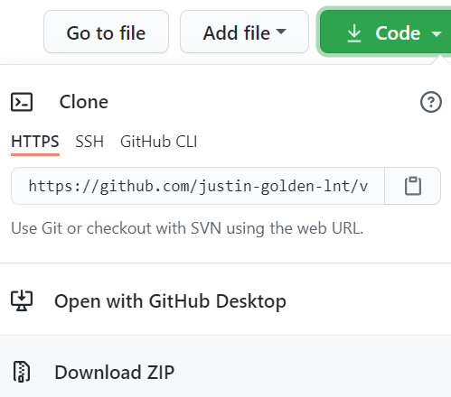

# Venue Generation Tool

A simple tool for adding a venue to ALMA

### PREREQUISITES

Make sure you have Python 3 installed.

(Any version will do; I recommend the latest stable version)

https://www.python.org/downloads/

### FIRST TIME SETUP

You can download the program from this repository by clicking `"Code" > "Download ZIP"`:

Then unzip the folder.

### USAGE

Double click `generate_venue.py` to run it.

(Alternatively, run `py generate_venue.py` from the command line in the current directory)

Enter:

- Court full name

- County

- State

- Court Level

The venue xml file will be generated for you, with the correct lookup table names and today's date.

If the state or court level are not found, you will be prompted again, and a list of available options will be displayed. These names are case-sensitive.

The file output.txt will contain the newly generated venue XML.

## FILES

`generate_venue.py`: The main script

`output.txt`: The output generated by the program upon completion

`README.md`: This file, which explains how to use the program

### NOTES

- Replace "replaceme" with the actual password in order to successfully upload the file (not added for security reasons)

- The output is saved as a .txt file instead of a .xml file for ease of use

### ADDING THE VENUE

Navigate to:

`ALMA > Setup > Tools > Xml Worksheet`

Then paste the XML code in and click "Post Data."

The message should say that it was inserted correctly. If an error is given, it is likely that you do not have the correct password for the `tc_xml` user.

### SAVING TIME

You may edit `generate_venue.py` with any plain text editor (such as notepad) and replace `replaceme` with the password, so you do not have to replace it each time. Do **NOT** share this publicly.

### ABOUT

Venue Generation Tool V.1.0.2

By Justin Golden

Contact: justin_golden@ahm.honda.com

Last updated: 01-22-2021

